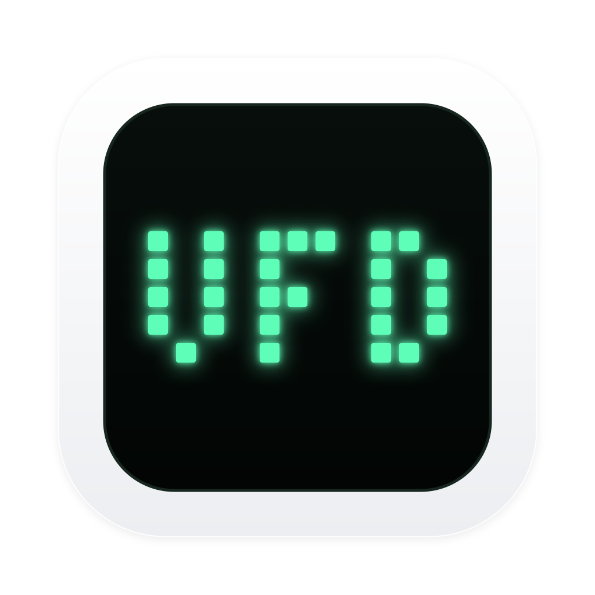
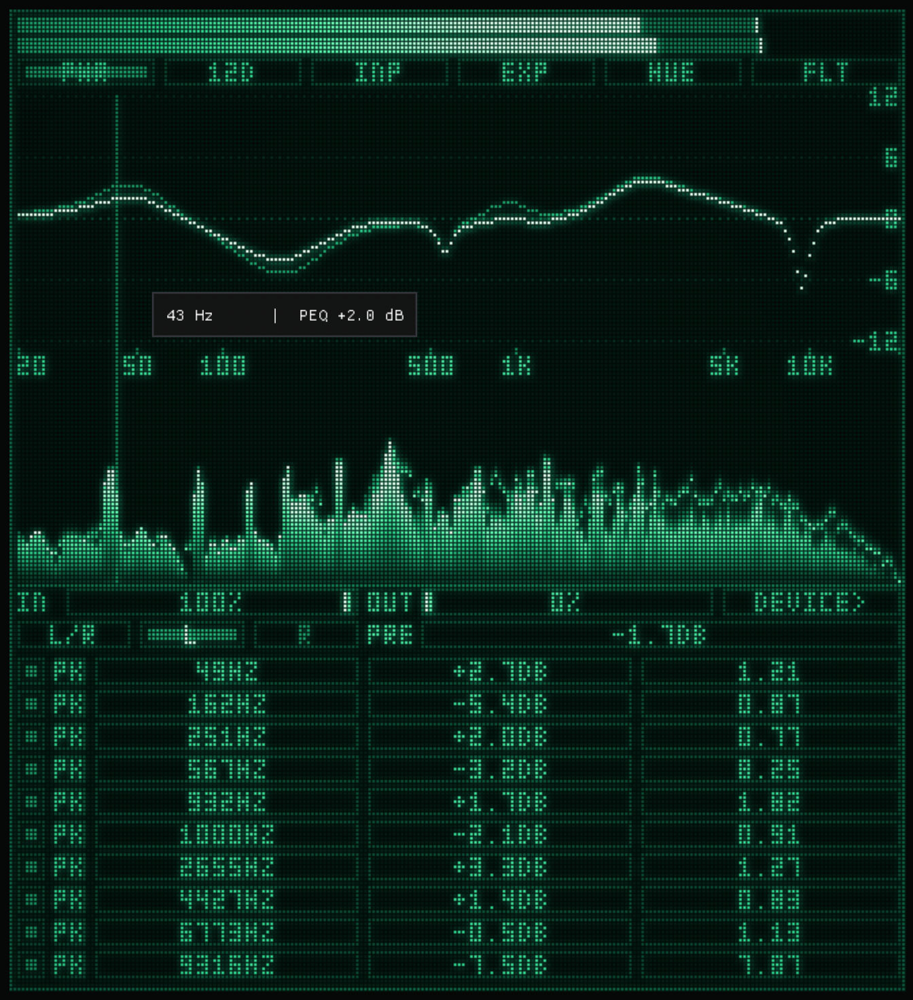
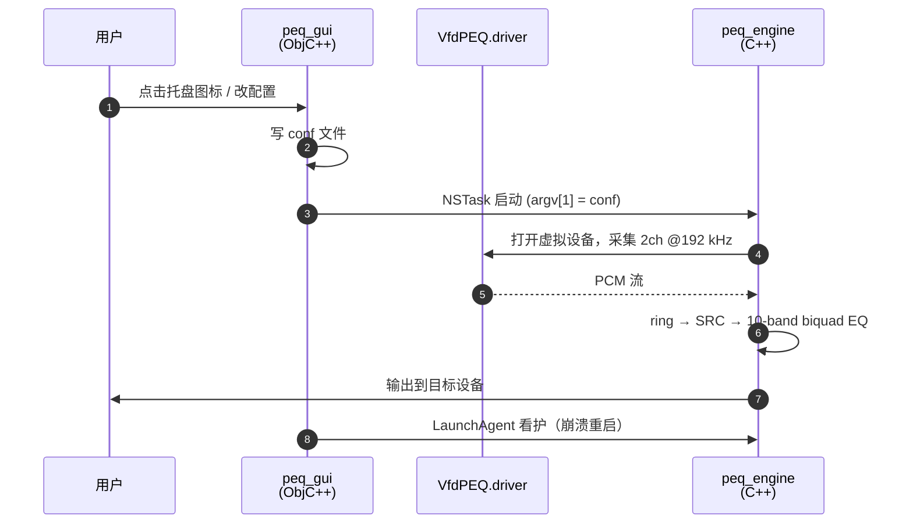

# VfdPEQ
 

**macOS 系统级多段参数均衡器** — 菜单栏应用 · 纯C/C++/Objective-C++实现 · Metal 渲染



> 装一次虚拟声卡，之后所有应用的声音都会经过一个 10 段 EQ 再送到你的扬声器/耳机。
> 屏幕上有一块荧光点阵屏（VFD 风格）实时显示频谱、声量和频响曲线，包含完整丰富的即时交互体验


## 安装

1. 下载 `VfdPEQ-<version>.dmg`，打开
2. 将 **VfdPEQ** 拖入 **Applications**
3. 打开 → 弹一次密码安装音频驱动 → 完成

## 使用

菜单栏出现 VfdPEQ 图标后，播放任意音乐——声音自动经过 EQ。

- **左键图标**：打开/隐藏 EQ 窗口
- **右键图标**：Core 开关 / 设备切换 / Launch at Login / About / Quit
- **窗口内**：10 段 EQ 全参数拖拽调节，双击输入精确值，频响曲线实时预览

详细操作说明见 [doc/USAGE01.md](doc/USAGE01.md)。

## 构建

```bash
# 需要已安装 Xcode Command Line Tools
cd driver  && make
cd engine  && make
cd gui     && make
./package.sh --build 0.2.1   # 或 ./package.sh 0.2.1（使用现有产物）
```

## 卸载

```bash
sudo /Applications/VfdPEQ.app/Contents/Resources/scripts/uninstall.sh
```
> 卸载不会删除 `~/.config/vfdpeq/` 中的用户配置
> dmg安装包中也带了一个一键卸载脚本

## 技术架构



- **驱动**：基于 [BlackHole](https://github.com/ExistentialAudio/BlackHole) (GPL-3.0)，固定 192kHz 采样率
- **引擎**：采集 → ring buffer → 10-band biquad → Core Audio SRC → 输出设备
- **GUI**：ImGui + Metal，VFD 点阵风格渲染引擎（7 种荧光配色主题）

## License

驱动部分基于 [BlackHole](https://github.com/ExistentialAudio/BlackHole) (GPL-3.0)。其余代码见 LICENSE。
